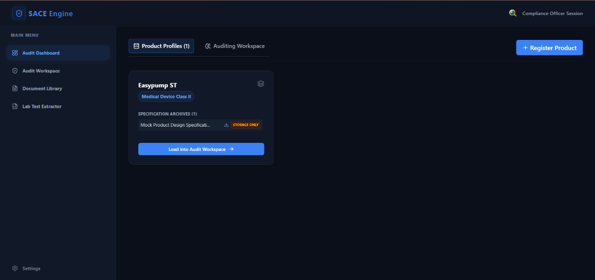
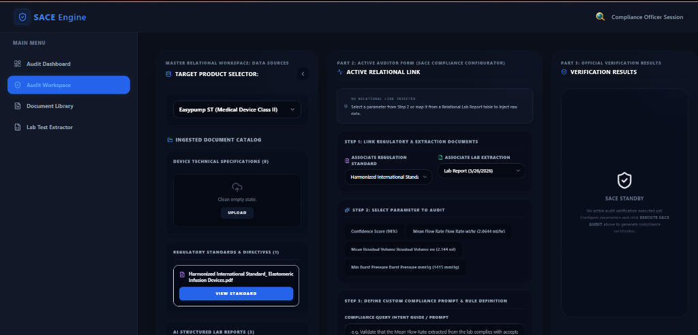
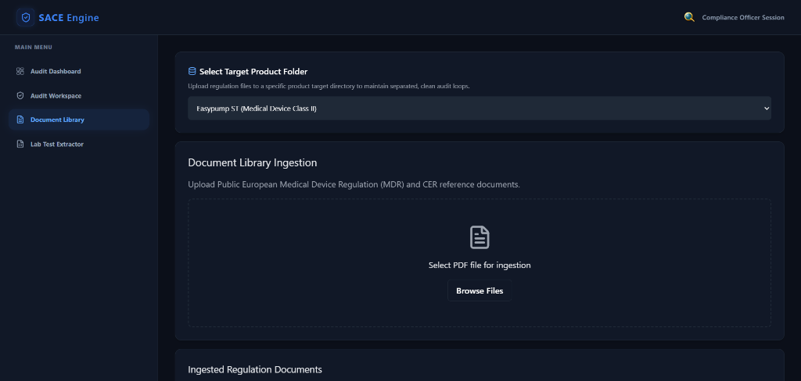
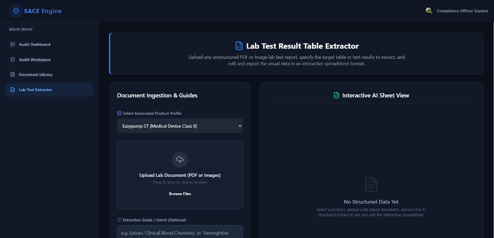

# 🛡️ SACE Engine — Sovereign Agentic Compliance Engine

**SACE Engine** is a full-stack, AI-powered regulatory compliance auditing and verification system. Engineered specifically for the MedTech sector, SACE automates the ingestion, extraction, and verification of complex safety metrics from unstructured medical device standard references (EU MDR / CER documents) and laboratory test reports. 

By combining multimodal document embeddings (**ColPali**), vision-language schema extraction (**Gemini Flash**), and a robust **Human-in-the-Loop (HITL)** relational validation pipeline, SACE eliminates hours of manual auditing while maintaining strict medical device safety standards.

---

## 🎨 Premium UI/UX & Dynamic Spatial Design

The SACE interface has been completely redesigned into a dark-mode dashboard themed around **glassmorphism, vibrant high-contrast accents, and dynamic spatial layouts**:

### 1. 3D Glowing Specular Logo
* Located in the sticky app header, the **Magnifying Glass logo** has been transitioned from flat 2D icons into a custom, hand-crafted **3D vector SVG element**:
  * **Chroma Gold Bevels**: Features a beveled frame shaded with speculative gold chrome gradients (`#ffffff` highlights, `#fef08a` warm gold, `#ca8a04` deep gold, and `#713f12` bronze occlusion shadows) to create realistic thickness.
  * **Glowing Cyan Lens**: Shaded with a high-contrast radial turquoise glow (`#67e8f9` to `#0891b2`), producing a futuristic convex glass scanner aesthetic that pops against the dark background.
  * **Floating Specular Shadow**: Offset drop-shadow matrices and `translateZ` styling elements make the vector logo float above the header surface.

### 2. Collapsible Data Sources Panel (Audit Workspace)
* Inside the **Audit Workspace**, a space-saving state toggle allows compliance officers to collapse or expand **Column 1 (Relational Data Sources)**:
  * **Collapsed Mode**: Slides into a compact `54px` vertical bar containing a haptic expand trigger, the database icon, and a vertical rotated text label (`DATA SOURCES`).
  * **Fluid CSS Transitions**: Adjusts widths dynamically with a smooth `all 0.3s ease` animation. Columns 2 and 3 automatically expand to occupy the newly available space (Form Configurator grows from `41%` to `58%`, and Verification Output grows from `28%` to `38%`).

### 3. Balanced Side-by-Side Extractor
* The **Lab Test Extractor** has been completely overhauled into a side-by-side balanced dashboard grid (`38%` / `62%` width partition), placing the document ingestion/upload zones directly next to the editable AI spreadsheet for rapid, low-friction side-by-side editing.

---

## 📖 Detailed Page Walkthroughs & User Guide

SACE is organized into four core workspaces, accessible via the main menu sidebar:

```
┌──────────────────────────────────────────────────────────────────────────┐
│                               SACE Engine                                │
├───────────────┬──────────────────────────────────────────────────────────┤
│ 📊 Dashboard  │ Register Product Profiles -> Load Active Spec Files     │
├───────────────┼──────────────────────────────────────────────────────────┤
│ 🛡️ Workspace  │ Link standard documents -> Configure limits -> Audit     │
├───────────────┼──────────────────────────────────────────────────────────┤
│ 📂 Doc Library│ Ingest standard PDFs -> Embed ColPali -> Index Qdrant    │
├───────────────┼──────────────────────────────────────────────────────────┤
│ 📝 Extractor  │ Upload lab report images/PDFs -> Edit HITL Spreadsheet   │
└───────────────┴──────────────────────────────────────────────────────────┘
```

---

### 1. Audit Dashboard (Product Directory)



#### 🔍 Function
The **Audit Dashboard** serves as the master directory and registration hub for all medical devices under review. Before any AI analysis or regulatory audit can occur, the device must be registered in the SACE Engine. This page manages product profiles (e.g., *Easypump ST*), stores their specific regulatory risk classifications (Class I, II, III), and archives initial design specification documents.

#### 👤 How It is Used by the User
1. **Initiate Product Registration**: Click the blue **+ Register Product** button in the top-right corner to open the creation modal.
2. **Configure Product Profile**: Enter the product name (e.g., `Easypump ST`) and assign its regulatory risk profile (e.g., `Medical Device Class II` or `Medical Device Class III`).
3. **Upload Specification Archives**: Select and upload the manufacturer's official design specifications and technical records. These are stored securely as raw reference archives (marked with a warning badge `STORAGE ONLY` until loaded).
4. **Load to Workspace**: Click the **Load into Audit Workspace** button on any product card. This instantly loads the selected device profile as the active global context for the rest of the application and redirects the user to the relational workspace.

---

### 2. Audit Workspace (End-to-End Auditor)



#### 🔍 Function
The **Audit Workspace** is the core mission control of the SACE platform. It bridges raw experimental laboratory test findings with target regulatory standard documents. By aligning these two distinct sources, it performs dynamic mathematical and logical checks to verify if the medical device operates within safe margins.

#### 👤 How It is Used by the User
1. **Leverage the Collapsible Sidebar**: Click the left chevron `<` on the `MASTER RELATIONAL WORKSPACE: DATA SOURCES` column to slide it closed, expanding the configurator and certificate views for distraction-free work. Click the haptic expand bar to bring it back.
2. **Select Target Product**: Toggle the active device in the Target Product Selector drop-down menu.
3. **Link Regulatory & Lab Documents (Step 1)**: Select an ingested regulatory reference standard (e.g., *Harmonized International Standard for Elastomeric Infusion Devices*) and match it to an active laboratory test report.
4. **Select Parameter (Step 2)**: Choose which extracted metric to audit (e.g., *Confidence Score, Mean Flow Rate, Mean Residual Volume, Min Burst Pressure*). The system renders these as clickable chips with real-time database value status.
5. **Map Raw Data**: Alternatively, select a cell from the bottom structured lab report tables and click `Map` to inject it directly into the Relational Link banner.
6. **Define Custom Prompt (Step 3)**: Write custom guidance for the LLM auditor (e.g., *"Validate that the Mean Flow Rate extracted from the lab complies with acceptable standards"*).
7. **Define Threshold Bounds (Step 4)**: Enter acceptable numeric minimum and maximum boundaries. The interactive gauge slider immediately updates visually to represent your configured thresholds.
8. **Simulate & Run Audit (Step 5)**: Choose to run a clean database-backed audit or simulate different scanning anomalies (e.g., *Blurry Scan*). Click the glowing **EXECUTE SACE AUDIT** button.
9. **Inspect Certificate**: View the official color-coded **Compliance Certificate** (PASS, FAIL, or UNVERIFIED) generated in Column 3. Check the arrow pointer (▼) on the dynamic color gauge to see exactly how close the device came to violating its limits.
10. **Archive Results**: Click `Log Certificate to History` to persist the record permanently to the Firestore historical registry at the bottom of the page.

---

### 3. Document Library (Regulatory Reference Repository)



#### 🔍 Function
The **Document Library** houses the authoritative regulatory baselines. SACE uses this page to index raw PDF files into a vector search repository. This allows the SACE AI to search through hundreds of pages of European Medical Device Regulations (MDR) to cross-reference constraints during the audit execution phase.

#### 👤 How It is Used by the User
1. **Select Target Folder**: Select the specific target product folder from the dropdown menu to keep regulations separated and neatly cataloged.
2. **Upload Standards**: Drag and drop a regulatory PDF or click **Browse Files** to select a PDF from your computer.
3. **Trigger Vector Pipeline**: Wait for the background vision embedding pipeline to complete. SACE renders a loading indicator while the FastAPI backend splits the document, creates visual embeddings with ColPali, and indexes them into Qdrant.
4. **Inspect Indexed Standards**: View the newly indexed PDF in the **Ingested Regulation Documents** list.
5. **View Standard**: Click **View Standard** or download the document to inspect the indexed standard.

---

### 4. Lab Test Extractor (Multimodal Vision Parser)



#### 🔍 Function
The **Lab Test Extractor** solves the manual data-entry bottleneck. Rather than manually typing rows of laboratory metrics, the Lab Test Extractor uses multimodal LLMs (Gemini Flash) to transcribe unstructured image scans and PDF reports into an interactive, clean numerical grid. It automatically standardizes and parses units to prevent downstream math errors.

#### 👤 How It is Used by the User
1. **Upload Report**: Select the associated product profile and upload a lab report PDF or image in the drag-and-drop zone.
2. **Add Guidance (Optional)**: Provide a targeted instruction in the *Extraction Guide / Intent* box to focus the extractor on specific metrics (e.g., *"Only extract flow rate parameters and pressure tests"*).
3. **Run AI Extraction**: Click the action button to process the scan.
4. **Verify and Refine**: Check the AI Confidence Score badge. Inspect the populated spreadsheet in the **Interactive AI Sheet View** on the right side-by-side panel.
5. **Direct Sheet Manipulation (HITL)**: Double-click any cell, header, or row to modify values manually.
6. **Add or Remove Cells**: Use the action toolbar to **Add Column** or **Add Row** if the LLM missed a key parameter, or delete irrelevant data.
7. **Save & Sync**: Click **Save Changes** to synchronize the table values directly to Firestore, making them instantly available for mapping in the **Audit Workspace**.
8. **Export Data**: Click **Export CSV** or **Export JSON** to download the structured table for standard clinical databases.

---

## ⚙️ Technical Architecture & Pipeline

```
┌──────────────────┐      Upload PDF       ┌──────────────────┐
│   Vite React     │ ────────────────────▶ │  FastAPI Backend │
│  (Port 5173)     │                       │  (Port 8000)     │
└────────┬─────────┘                       └────────┬─────────┘
         ▲                                          │
         │                                          ▼
         │                                 ┌──────────────────┐
         │                                 │   ColPali API    │
         │        JSON Ingress Data        │   (GPU Server)   │
         │ ◀────────────────────────────── └────────┬─────────┘
         │                                          ▼
┌────────┴─────────┐                       ┌──────────────────┐
│  Firebase Db     │ ◀──────────────────── │   Local Qdrant   │
│  (Firestore +    │   Persist Metadata    │   (MaxSim 128D)  │
│   Storage)       │                       │                  │
└──────────────────┘                       └──────────────────┘
```

### Pipeline Execution Flow
1. **Regulatory Ingestion**: A PDF is uploaded to the `/upload` backend endpoint. The file is split into page images, embedded via a remote GPU-backed ColPali pipeline, and indexed into the local Qdrant collection under a unique `document_id`.
2. **Vision-Language Extraction**: A lab report image is uploaded. The `/api/extract-lab-table` endpoint parses the image using Gemini Flash under a strict structural JSON schema. The resulting structured JSON is returned to the frontend and persisted in **Firebase Firestore**.
3. **Relational Threshold Audit**: The compliance officer selects an active product standard and maps a lab parameter. The SACE Engine compares the numerical values against configured bounds, generates a cryptographically hashed certificate, and pushes the verification to the Firestore log registry.

---

## 🚀 Setup & Local Execution

### Prerequisites
- **Python 3.10+**
- **Node.js 18+**
- **Google Gemini API Key** ([Get one here](https://aistudio.google.com/apikey))
- **Firebase Project** (Firestore and Cloud Storage enabled)

### 1. Clone & Directory Navigation
```bash
git clone https://github.com/KushairiNorazli/SACE-mvp.git
cd SACE-mvp
```

### 2. Backend Setup
```bash
cd backend

# Create Virtual Environment
python -m venv venv
# Activate (Windows)
.\venv\Scripts\activate

# Install Dependencies
pip install fastapi uvicorn requests python-dotenv qdrant-client pydantic httpx

# Configure Environment Variables
cp .env.example .env
```

Edit your `backend/.env` file:
```env
GEMINI_API_KEY="your-gemini-api-key"
GEMINI_MODEL="gemini-flash-latest"
COLPALI_API_URL="https://your-ngrok-url.ngrok-free.app/embed_pdf"
```

Start the FastAPI server:
```bash
python -m uvicorn main:app --host 127.0.0.1 --port 8000
```

### 3. Frontend Setup
```bash
cd ../frontend

# Install Dependencies
npm install

# Configure Environment Variables
cp .env.example .env.local
```

Edit your `frontend/.env.local` to include your Firebase credentials:
```env
VITE_FIREBASE_API_KEY="your-firebase-api-key"
VITE_FIREBASE_AUTH_DOMAIN="your-project.firebaseapp.com"
VITE_FIREBASE_PROJECT_ID="your-project-id"
VITE_FIREBASE_STORAGE_BUCKET="your-project.appspot.com"
VITE_FIREBASE_MESSAGING_SENDER_ID="your-sender-id"
VITE_FIREBASE_APP_ID="your-app-id"
```

Start the Vite dev server:
```bash
npm run dev
```

Visit the dashboard at **http://localhost:5173**.

---

> Built as an advanced corporate MVP for the Sovereign Agentic Compliance Engine — automating clinical standards auditing with multimodal AI, vector embeddings, and zero-compromise dark-mode layouts.
